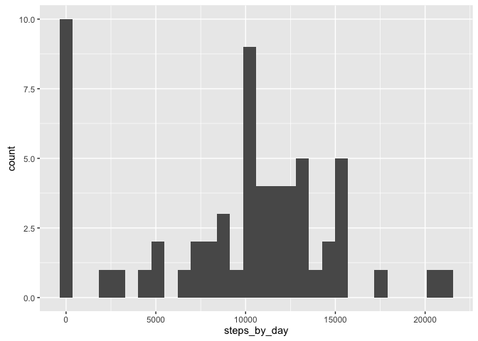
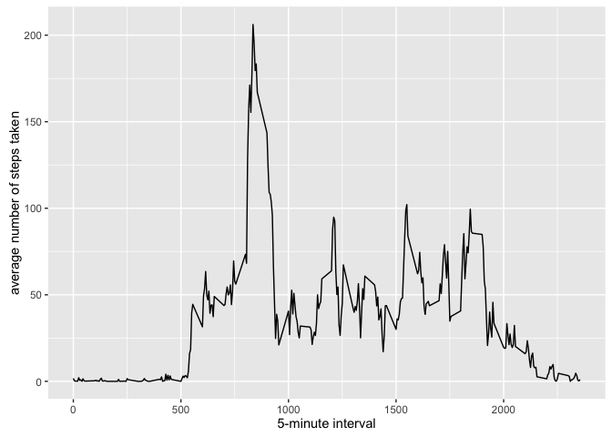
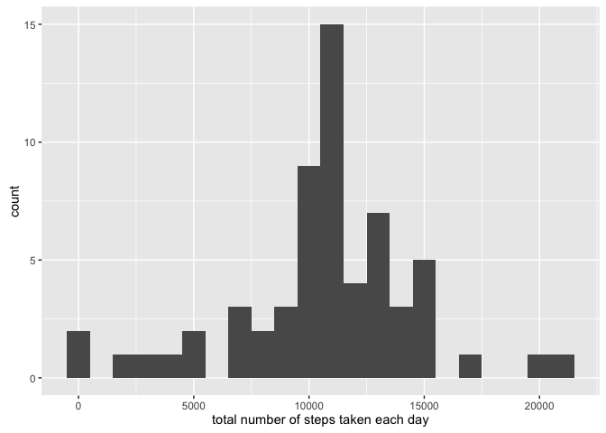
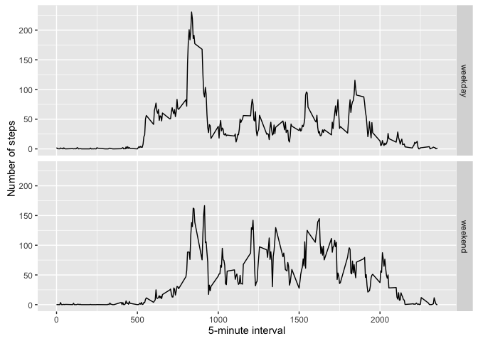

# Reproducible Research: Peer Assessment 1


## Loading and preprocessing the data


```r
data1 <- read.csv("activity.csv")
data <- data1
```


## What is mean total number of steps taken per day?

```r
steps_by_day <- tapply(data1$steps, data1$date, sum, na.rm=TRUE)
library(ggplot2)

a <- qplot(steps_by_day)
print(a)
```

```
## `stat_bin()` using `bins = 30`. Pick better value with `binwidth`.
```



```r
mean_steps_by_day <- tapply(data1$steps, data1$date, mean, na.rm = TRUE)
median_steps_by_day <- tapply(data1$steps, data1$date, median, na.rm=TRUE)

library(xtable)
xtmean <- xtable(as.matrix(mean_steps_by_day))
print(xtmean, type="html")
```

<!-- html table generated in R 3.2.4 by xtable 1.8-2 package -->
<!-- Sun Jun  5 15:43:30 2016 -->
<table border=1>
<tr> <th>  </th> <th> x </th>  </tr>
  <tr> <td align="right"> 2012-10-01 </td> <td align="right">  </td> </tr>
  <tr> <td align="right"> 2012-10-02 </td> <td align="right"> 0.44 </td> </tr>
  <tr> <td align="right"> 2012-10-03 </td> <td align="right"> 39.42 </td> </tr>
  <tr> <td align="right"> 2012-10-04 </td> <td align="right"> 42.07 </td> </tr>
  <tr> <td align="right"> 2012-10-05 </td> <td align="right"> 46.16 </td> </tr>
  <tr> <td align="right"> 2012-10-06 </td> <td align="right"> 53.54 </td> </tr>
  <tr> <td align="right"> 2012-10-07 </td> <td align="right"> 38.25 </td> </tr>
  <tr> <td align="right"> 2012-10-08 </td> <td align="right">  </td> </tr>
  <tr> <td align="right"> 2012-10-09 </td> <td align="right"> 44.48 </td> </tr>
  <tr> <td align="right"> 2012-10-10 </td> <td align="right"> 34.38 </td> </tr>
  <tr> <td align="right"> 2012-10-11 </td> <td align="right"> 35.78 </td> </tr>
  <tr> <td align="right"> 2012-10-12 </td> <td align="right"> 60.35 </td> </tr>
  <tr> <td align="right"> 2012-10-13 </td> <td align="right"> 43.15 </td> </tr>
  <tr> <td align="right"> 2012-10-14 </td> <td align="right"> 52.42 </td> </tr>
  <tr> <td align="right"> 2012-10-15 </td> <td align="right"> 35.20 </td> </tr>
  <tr> <td align="right"> 2012-10-16 </td> <td align="right"> 52.38 </td> </tr>
  <tr> <td align="right"> 2012-10-17 </td> <td align="right"> 46.71 </td> </tr>
  <tr> <td align="right"> 2012-10-18 </td> <td align="right"> 34.92 </td> </tr>
  <tr> <td align="right"> 2012-10-19 </td> <td align="right"> 41.07 </td> </tr>
  <tr> <td align="right"> 2012-10-20 </td> <td align="right"> 36.09 </td> </tr>
  <tr> <td align="right"> 2012-10-21 </td> <td align="right"> 30.63 </td> </tr>
  <tr> <td align="right"> 2012-10-22 </td> <td align="right"> 46.74 </td> </tr>
  <tr> <td align="right"> 2012-10-23 </td> <td align="right"> 30.97 </td> </tr>
  <tr> <td align="right"> 2012-10-24 </td> <td align="right"> 29.01 </td> </tr>
  <tr> <td align="right"> 2012-10-25 </td> <td align="right"> 8.65 </td> </tr>
  <tr> <td align="right"> 2012-10-26 </td> <td align="right"> 23.53 </td> </tr>
  <tr> <td align="right"> 2012-10-27 </td> <td align="right"> 35.14 </td> </tr>
  <tr> <td align="right"> 2012-10-28 </td> <td align="right"> 39.78 </td> </tr>
  <tr> <td align="right"> 2012-10-29 </td> <td align="right"> 17.42 </td> </tr>
  <tr> <td align="right"> 2012-10-30 </td> <td align="right"> 34.09 </td> </tr>
  <tr> <td align="right"> 2012-10-31 </td> <td align="right"> 53.52 </td> </tr>
  <tr> <td align="right"> 2012-11-01 </td> <td align="right">  </td> </tr>
  <tr> <td align="right"> 2012-11-02 </td> <td align="right"> 36.81 </td> </tr>
  <tr> <td align="right"> 2012-11-03 </td> <td align="right"> 36.70 </td> </tr>
  <tr> <td align="right"> 2012-11-04 </td> <td align="right">  </td> </tr>
  <tr> <td align="right"> 2012-11-05 </td> <td align="right"> 36.25 </td> </tr>
  <tr> <td align="right"> 2012-11-06 </td> <td align="right"> 28.94 </td> </tr>
  <tr> <td align="right"> 2012-11-07 </td> <td align="right"> 44.73 </td> </tr>
  <tr> <td align="right"> 2012-11-08 </td> <td align="right"> 11.18 </td> </tr>
  <tr> <td align="right"> 2012-11-09 </td> <td align="right">  </td> </tr>
  <tr> <td align="right"> 2012-11-10 </td> <td align="right">  </td> </tr>
  <tr> <td align="right"> 2012-11-11 </td> <td align="right"> 43.78 </td> </tr>
  <tr> <td align="right"> 2012-11-12 </td> <td align="right"> 37.38 </td> </tr>
  <tr> <td align="right"> 2012-11-13 </td> <td align="right"> 25.47 </td> </tr>
  <tr> <td align="right"> 2012-11-14 </td> <td align="right">  </td> </tr>
  <tr> <td align="right"> 2012-11-15 </td> <td align="right"> 0.14 </td> </tr>
  <tr> <td align="right"> 2012-11-16 </td> <td align="right"> 18.89 </td> </tr>
  <tr> <td align="right"> 2012-11-17 </td> <td align="right"> 49.79 </td> </tr>
  <tr> <td align="right"> 2012-11-18 </td> <td align="right"> 52.47 </td> </tr>
  <tr> <td align="right"> 2012-11-19 </td> <td align="right"> 30.70 </td> </tr>
  <tr> <td align="right"> 2012-11-20 </td> <td align="right"> 15.53 </td> </tr>
  <tr> <td align="right"> 2012-11-21 </td> <td align="right"> 44.40 </td> </tr>
  <tr> <td align="right"> 2012-11-22 </td> <td align="right"> 70.93 </td> </tr>
  <tr> <td align="right"> 2012-11-23 </td> <td align="right"> 73.59 </td> </tr>
  <tr> <td align="right"> 2012-11-24 </td> <td align="right"> 50.27 </td> </tr>
  <tr> <td align="right"> 2012-11-25 </td> <td align="right"> 41.09 </td> </tr>
  <tr> <td align="right"> 2012-11-26 </td> <td align="right"> 38.76 </td> </tr>
  <tr> <td align="right"> 2012-11-27 </td> <td align="right"> 47.38 </td> </tr>
  <tr> <td align="right"> 2012-11-28 </td> <td align="right"> 35.36 </td> </tr>
  <tr> <td align="right"> 2012-11-29 </td> <td align="right"> 24.47 </td> </tr>
  <tr> <td align="right"> 2012-11-30 </td> <td align="right">  </td> </tr>
   </table>

```r
xtmedian <- xtable(as.matrix(median_steps_by_day))
print(xtmedian, type = "html")
```

<!-- html table generated in R 3.2.4 by xtable 1.8-2 package -->
<!-- Sun Jun  5 15:43:30 2016 -->
<table border=1>
<tr> <th>  </th> <th> x </th>  </tr>
  <tr> <td align="right"> 2012-10-01 </td> <td align="right">  </td> </tr>
  <tr> <td align="right"> 2012-10-02 </td> <td align="right"> 0.00 </td> </tr>
  <tr> <td align="right"> 2012-10-03 </td> <td align="right"> 0.00 </td> </tr>
  <tr> <td align="right"> 2012-10-04 </td> <td align="right"> 0.00 </td> </tr>
  <tr> <td align="right"> 2012-10-05 </td> <td align="right"> 0.00 </td> </tr>
  <tr> <td align="right"> 2012-10-06 </td> <td align="right"> 0.00 </td> </tr>
  <tr> <td align="right"> 2012-10-07 </td> <td align="right"> 0.00 </td> </tr>
  <tr> <td align="right"> 2012-10-08 </td> <td align="right">  </td> </tr>
  <tr> <td align="right"> 2012-10-09 </td> <td align="right"> 0.00 </td> </tr>
  <tr> <td align="right"> 2012-10-10 </td> <td align="right"> 0.00 </td> </tr>
  <tr> <td align="right"> 2012-10-11 </td> <td align="right"> 0.00 </td> </tr>
  <tr> <td align="right"> 2012-10-12 </td> <td align="right"> 0.00 </td> </tr>
  <tr> <td align="right"> 2012-10-13 </td> <td align="right"> 0.00 </td> </tr>
  <tr> <td align="right"> 2012-10-14 </td> <td align="right"> 0.00 </td> </tr>
  <tr> <td align="right"> 2012-10-15 </td> <td align="right"> 0.00 </td> </tr>
  <tr> <td align="right"> 2012-10-16 </td> <td align="right"> 0.00 </td> </tr>
  <tr> <td align="right"> 2012-10-17 </td> <td align="right"> 0.00 </td> </tr>
  <tr> <td align="right"> 2012-10-18 </td> <td align="right"> 0.00 </td> </tr>
  <tr> <td align="right"> 2012-10-19 </td> <td align="right"> 0.00 </td> </tr>
  <tr> <td align="right"> 2012-10-20 </td> <td align="right"> 0.00 </td> </tr>
  <tr> <td align="right"> 2012-10-21 </td> <td align="right"> 0.00 </td> </tr>
  <tr> <td align="right"> 2012-10-22 </td> <td align="right"> 0.00 </td> </tr>
  <tr> <td align="right"> 2012-10-23 </td> <td align="right"> 0.00 </td> </tr>
  <tr> <td align="right"> 2012-10-24 </td> <td align="right"> 0.00 </td> </tr>
  <tr> <td align="right"> 2012-10-25 </td> <td align="right"> 0.00 </td> </tr>
  <tr> <td align="right"> 2012-10-26 </td> <td align="right"> 0.00 </td> </tr>
  <tr> <td align="right"> 2012-10-27 </td> <td align="right"> 0.00 </td> </tr>
  <tr> <td align="right"> 2012-10-28 </td> <td align="right"> 0.00 </td> </tr>
  <tr> <td align="right"> 2012-10-29 </td> <td align="right"> 0.00 </td> </tr>
  <tr> <td align="right"> 2012-10-30 </td> <td align="right"> 0.00 </td> </tr>
  <tr> <td align="right"> 2012-10-31 </td> <td align="right"> 0.00 </td> </tr>
  <tr> <td align="right"> 2012-11-01 </td> <td align="right">  </td> </tr>
  <tr> <td align="right"> 2012-11-02 </td> <td align="right"> 0.00 </td> </tr>
  <tr> <td align="right"> 2012-11-03 </td> <td align="right"> 0.00 </td> </tr>
  <tr> <td align="right"> 2012-11-04 </td> <td align="right">  </td> </tr>
  <tr> <td align="right"> 2012-11-05 </td> <td align="right"> 0.00 </td> </tr>
  <tr> <td align="right"> 2012-11-06 </td> <td align="right"> 0.00 </td> </tr>
  <tr> <td align="right"> 2012-11-07 </td> <td align="right"> 0.00 </td> </tr>
  <tr> <td align="right"> 2012-11-08 </td> <td align="right"> 0.00 </td> </tr>
  <tr> <td align="right"> 2012-11-09 </td> <td align="right">  </td> </tr>
  <tr> <td align="right"> 2012-11-10 </td> <td align="right">  </td> </tr>
  <tr> <td align="right"> 2012-11-11 </td> <td align="right"> 0.00 </td> </tr>
  <tr> <td align="right"> 2012-11-12 </td> <td align="right"> 0.00 </td> </tr>
  <tr> <td align="right"> 2012-11-13 </td> <td align="right"> 0.00 </td> </tr>
  <tr> <td align="right"> 2012-11-14 </td> <td align="right">  </td> </tr>
  <tr> <td align="right"> 2012-11-15 </td> <td align="right"> 0.00 </td> </tr>
  <tr> <td align="right"> 2012-11-16 </td> <td align="right"> 0.00 </td> </tr>
  <tr> <td align="right"> 2012-11-17 </td> <td align="right"> 0.00 </td> </tr>
  <tr> <td align="right"> 2012-11-18 </td> <td align="right"> 0.00 </td> </tr>
  <tr> <td align="right"> 2012-11-19 </td> <td align="right"> 0.00 </td> </tr>
  <tr> <td align="right"> 2012-11-20 </td> <td align="right"> 0.00 </td> </tr>
  <tr> <td align="right"> 2012-11-21 </td> <td align="right"> 0.00 </td> </tr>
  <tr> <td align="right"> 2012-11-22 </td> <td align="right"> 0.00 </td> </tr>
  <tr> <td align="right"> 2012-11-23 </td> <td align="right"> 0.00 </td> </tr>
  <tr> <td align="right"> 2012-11-24 </td> <td align="right"> 0.00 </td> </tr>
  <tr> <td align="right"> 2012-11-25 </td> <td align="right"> 0.00 </td> </tr>
  <tr> <td align="right"> 2012-11-26 </td> <td align="right"> 0.00 </td> </tr>
  <tr> <td align="right"> 2012-11-27 </td> <td align="right"> 0.00 </td> </tr>
  <tr> <td align="right"> 2012-11-28 </td> <td align="right"> 0.00 </td> </tr>
  <tr> <td align="right"> 2012-11-29 </td> <td align="right"> 0.00 </td> </tr>
  <tr> <td align="right"> 2012-11-30 </td> <td align="right">  </td> </tr>
   </table>


## What is the average daily activity pattern?


```r
library(ggplot2)
averages <- aggregate(x=list(steps = data$steps), by=list(interval=data$interval), FUN=mean, na.rm=TRUE)
ggplot(averages, aes(x=interval, y=steps)) +
    geom_line() +
    xlab("5-minute interval") + 
    ylab("average number of steps taken")
```



On average across all the days in the dataset, the 5-minute interval contains the maximum number of steps?

```r
averages[which.max(averages$steps),]
```

## Imputing missing values
-  Calculate and report the total number of missing values in the dataset
(i.e. the total number of rows with NAs)


```r
a <- data1[is.na(data1$steps),]
nrow(a)
```

```
## [1] 2304
```

Now we fill the missing values using the means of the 5-min intervals 

```r
fill.val <- function(steps,interval) {
    filled <- NA
    if(!is.na(steps))
        filled <- c(steps)
    else 
        filled <- averages[averages$interval==interval, "steps"]
        return(filled)
}

filled.data <- data
filled.data$steps <- mapply(fill.val, filled.data$steps, filled.data$interval)
```
Now using the filled data set, lets make a histogram of the total number of steps taken each day and calculate the mean and the median total number of steps

```r
total.steps <- tapply(filled.data$steps, filled.data$date, FUN=sum)
qplot(total.steps, binwidth=1000, xlab="total number of steps taken each day")
```



```r
mean(total.steps)
```

```
## [1] 10766.19
```

```r
median(total.steps)
```

```
## [1] 10766.19
```
## Are there differences in activity patterns between weekdays and weekends?


```r
weekday.or.weekend <-function(date) {
    day <- weekdays(date)
    if(day %in% c("Monday","Tuesday", "Wednesday", "Thursday", "Friday"))
        return("weekday") 
    else if (day %in% c("Saturday", "Sunday"))
        return("weekend")
    else
        stop("invalid date")
}

filled.data$date <- as.Date(filled.data$date)
filled.data$day <- sapply(filled.data$date, FUN = weekday.or.weekend)

averages <- aggregate(steps ~ interval + day, data=filled.data, mean)
ggplot(averages, aes(y= steps, x =interval)) +
        geom_line() +
        facet_grid(day~.) +
        xlab("5-minute interval") + 
        ylab("Number of steps")
```


